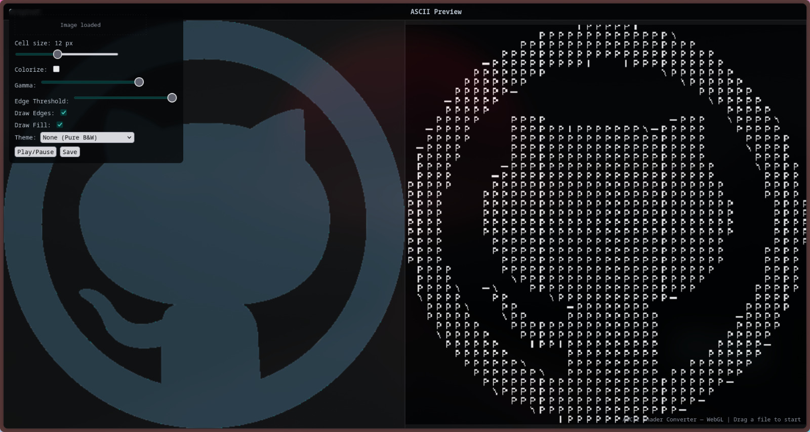
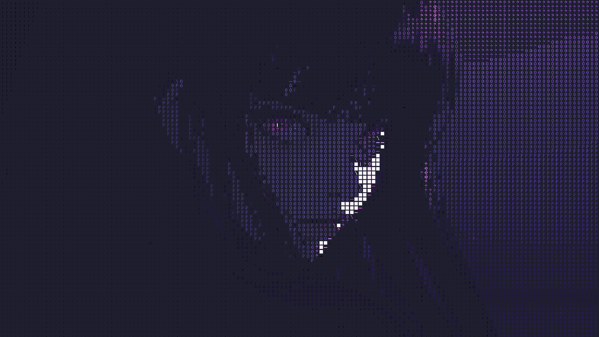
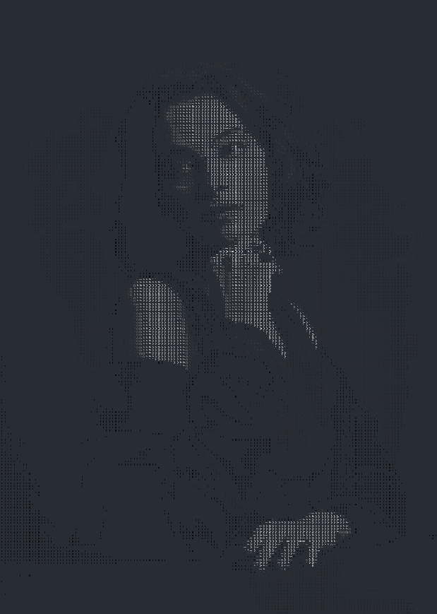
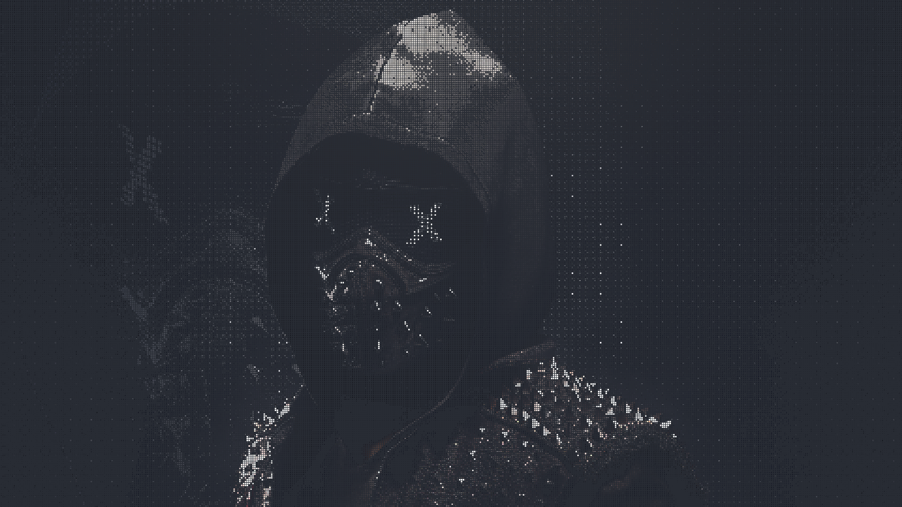
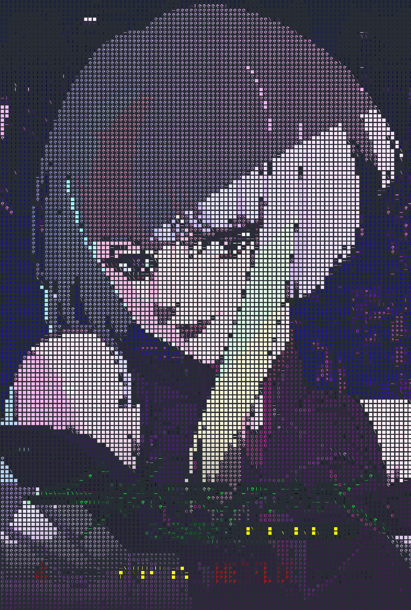

# MG-to-ASCII

Convert any image into colorful ASCII art. This tool takes your photos and turns them into text characters while keeping all the original colors, creating stunning visual art that works in web browsers.

## Quick Start

**Windows:**

```bash
run.bat
```

**Linux/Mac:**

```bash
./run.sh
```

Open your browser, upload an image, and adjust the sliders to customize your ASCII art. Export as HTML or view directly in the browser.

## 🎨 Gallery Showcase

### Example 1



### Example 2



### Example 3



### Example 4




#### Example 5


